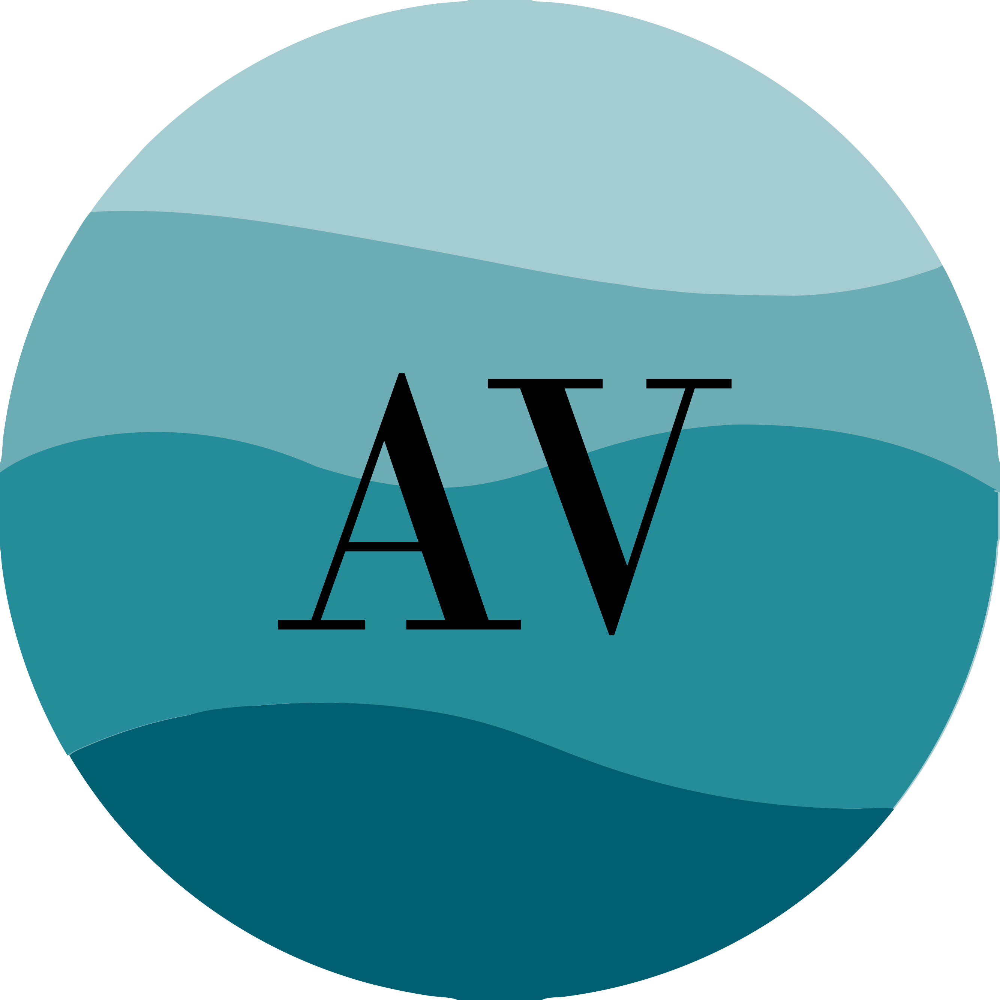

# AquaVista

## 🌍Idea 

Using satellite imagery, we assess beach water conditions and provide real-time quality ratings, ensuring safer, cleaner coastal environments through accurate data analysis.

## 🛰️EU space technologies 

Using Sentinel 3's xx, yy and temperature sensors, we extract and analyze data to provide comprehensive information to our clients. 

## 🏙️Sustainable living (Challenge 2)

We provide data points of water quality to citizens and innovative tools for regional and municipal authorities. 

## 👨‍👨‍👦‍👦👪Meet our Team  

| Nombre                | Cargo                                             |
|-----------------------|---------------------------------------------------|
| Óscar Sardà Martín    | CTO (Technical EO Product and Service Development)|
| David Sardà Martín    | CDO (UI and UX Creative)                          |
| Mario Lacueva Conesa  | CBO (Business Modelling and Value Engineering)    |
| Gerard García Gros    | Technical Product Developer                      |
| Jan Moran Ricardo     | CTO (Technical EO Product and Service Development)|
| Arnau Fosch Ferrer    | Technical Product Developer                      |
| Biel Barón Ciriano    | CEO (Leadership Management and Business Developer)|
